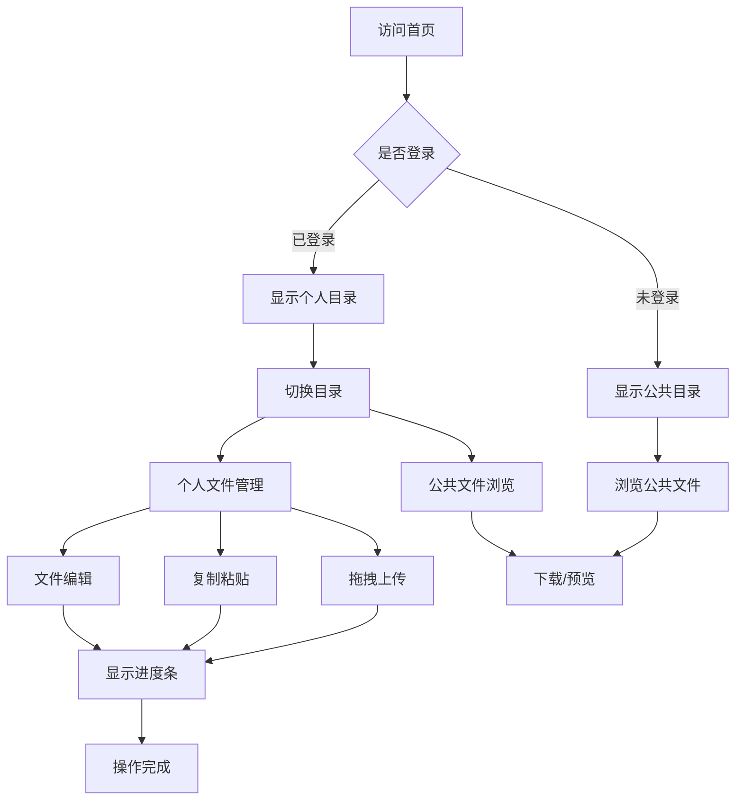

## 1. 产品概述
NeoShare是一款轻量级服务器文件管理软件，提供类似Windows资源管理器的Web界面，支持公共文件共享和个人文件管理。用户无需登录即可浏览和下载公共文件，登录后可管理个人文件并享受完整的文件操作功能。

产品主要解决团队协作中的文件共享需求，适用于需要便捷文件管理和共享的企业、学校、开发团队等场景，提供科技感十足的现代化界面体验。

## 2. 核心功能

### 2.1 用户角色
| 角色 | 注册方式 | 核心权限 |
|------|----------|----------|
| 访客 | 无需注册 | 浏览和下载公共文件 |
| 普通用户 | 管理员创建 | 管理个人文件、上传下载、预览编辑 |
| 管理员 | 初始管理员 | 创建删除用户、管理所有文件 |

### 2.2 功能模块
NeoShare主要包含以下核心页面：
1. **主界面**：左侧边栏（公共/个人目录切换）、文件资源管理器、搜索框、用户头像菜单
2. **用户设置页**：头像设置、昵称修改、个性签名编辑
3. **用户管理页**：用户列表、创建用户、删除用户（仅管理员）

### 2.3 页面详情
| 页面名称 | 模块名称 | 功能描述 |
|----------|----------|----------|
| 主界面 | 左侧边栏 | 显示公共文件目录和个人文件目录，支持点击切换 |
| 主界面 | 文件资源管理器 | 显示文件列表/图标，支持拖拽上传、复制粘贴、格式切换 |
| 主界面 | 搜索框 | 输入关键字搜索文件和文件夹 |
| 主界面 | 用户头像菜单 | 悬停显示下拉菜单，包含设置和退出选项 |
| 主界面 | 进度条 | 文件操作时显示进度，完成后自动消失 |
| 用户设置页 | 头像设置 | 上传和修改用户头像 |
| 用户设置页 | 基本信息 | 修改昵称和个性签名 |
| 用户管理页 | 用户列表 | 显示所有用户信息 |
| 用户管理页 | 用户操作 | 创建新用户、删除现有用户 |

## 3. 核心流程

### 访客流程
访客访问网站 → 默认显示公共文件目录 → 浏览文件列表 → 点击下载文件 → 双击预览支持的文件格式

### 用户流程
用户登录 → 默认显示个人文件目录 → 可以切换查看公共目录 → 拖拽上传文件 → 复制粘贴文件 → 双击编辑支持的文件格式 → 下载文件

### 管理员流程
管理员登录 → 可以访问用户管理 → 创建新用户 → 删除用户 → 管理所有文件

## 4. 用户界面设计

### 4.1 设计风格
- **主色调**：深灰色背景（#1a1a1a）配紫红色点缀（#d946ef）
- **按钮样式**：圆角矩形设计，悬停时有紫红色光晕效果
- **字体**：使用现代无衬线字体，主要文字14-16px，标题18-24px
- **布局风格**：左侧边栏固定宽度，主内容区域自适应，卡片式文件展示
- **图标风格**：采用简约线条图标，配合紫红色的选中状态

### 4.2 页面设计概览
| 页面名称 | 模块名称 | UI元素 |
|----------|----------|--------|
| 主界面 | 左侧边栏 | 深灰色背景，紫红色选中状态，图标+文字导航，鼠标悬停显示浅灰色背景 |
| 主界面 | 文件资源管理器 | 顶部工具栏（搜索框、视图切换按钮），主区域支持列表/图标视图，文件项悬停显示操作按钮 |
| 主界面 | 用户头像 | 右上角圆形头像，悬停显示下拉菜单，紫红色边框高亮 |
| 主界面 | 进度条 | 顶部细长进度条，紫红色渐变，自动消失动画 |
| 用户设置页 | 设置表单 | 卡片式布局，输入框圆角设计，保存按钮紫红色背景 |
| 用户管理页 | 用户表格 | 斑马纹表格行，操作按钮组，紫红色的新建用户按钮 |

### 4.3 响应式设计
采用桌面端优先设计，主界面在1200px以上宽度时显示完整的三栏布局（侧边栏+主内容+右侧预览），在768-1200px时侧边栏可收起，768px以下时采用移动端适配，侧边栏变为底部导航栏。