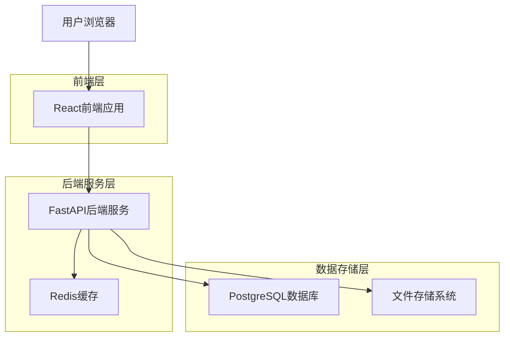
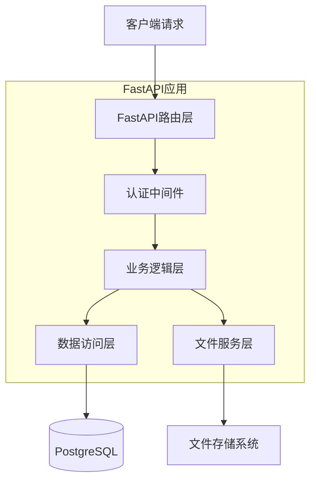
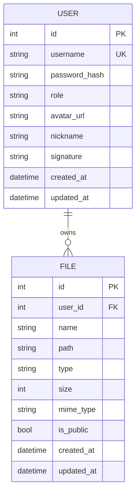

## 1. 架构设计



## 2. 技术描述

- **前端**: React@18 + TypeScript + TailwindCSS + Vite
- **初始化工具**: vite-init
- **后端**: FastAPI@0.104 + Python@3.11
- **数据库**: PostgreSQL@15 + SQLAlchemy@2.0
- **文件存储**: 本地文件系统 + MinIO（可选）
- **缓存**: Redis@7
- **身份认证**: JWT + python-jose
- **文件预览**: python-magic + PyPDF2

## 3. 路由定义

| 路由 | 用途 |
|------|------|
| / | 主界面，文件资源管理器 |
| /login | 用户登录页面 |
| /settings | 用户设置页面 |
| /admin/users | 用户管理页面（管理员） |
| /api/auth/* | 认证相关API |
| /api/files/* | 文件操作API |
| /api/users/* | 用户管理API |

## 4. API定义

### 4.1 认证API

**用户登录**
```
POST /api/auth/login
```

请求参数：
| 参数名 | 参数类型 | 是否必需 | 描述 |
|--------|----------|----------|------|
| username | string | 是 | 用户名 |
| password | string | 是 | 密码 |

响应示例：
```json
{
  "access_token": "eyJhbGciOiJIUzI1NiIsInR5cCI6IkpXVCJ9...",
  "token_type": "bearer",
  "user": {
    "id": 1,
    "username": "admin",
    "role": "admin"
  }
}
```

### 4.2 文件API

**获取文件列表**
```
GET /api/files/list
```

请求参数：
| 参数名 | 参数类型 | 是否必需 | 描述 |
|--------|----------|----------|------|
| path | string | 否 | 目录路径 |
| type | string | 否 | 目录类型（public/private） |

**上传文件**
```
POST /api/files/upload
```

请求参数：
| 参数名 | 参数类型 | 是否必需 | 描述 |
|--------|----------|----------|------|
| file | File | 是 | 文件对象 |
| path | string | 是 | 上传路径 |

**下载文件**
```
GET /api/files/download/{file_id}
```

**删除文件**
```
DELETE /api/files/{file_id}
```

### 4.3 用户管理API

**获取用户列表**
```
GET /api/users
```

**创建用户**
```
POST /api/users
```

请求参数：
| 参数名 | 参数类型 | 是否必需 | 描述 |
|--------|----------|----------|------|
| username | string | 是 | 用户名 |
| password | string | 是 | 密码 |
| role | string | 是 | 用户角色 |

**删除用户**
```
DELETE /api/users/{user_id}
```

## 5. 服务器架构图



## 6. 数据模型

### 6.1 数据模型定义



### 6.2 数据定义语言

**用户表（users）**
```sql
CREATE TABLE users (
    id SERIAL PRIMARY KEY,
    username VARCHAR(50) UNIQUE NOT NULL,
    password_hash VARCHAR(255) NOT NULL,
    role VARCHAR(20) DEFAULT 'user' CHECK (role IN ('user', 'admin')),
    avatar_url VARCHAR(500),
    nickname VARCHAR(100),
    signature VARCHAR(500),
    created_at TIMESTAMP DEFAULT CURRENT_TIMESTAMP,
    updated_at TIMESTAMP DEFAULT CURRENT_TIMESTAMP
);

CREATE INDEX idx_users_username ON users(username);
CREATE INDEX idx_users_role ON users(role);
```

**文件表（files）**
```sql
CREATE TABLE files (
    id SERIAL PRIMARY KEY,
    user_id INTEGER REFERENCES users(id) ON DELETE CASCADE,
    name VARCHAR(255) NOT NULL,
    path VARCHAR(500) NOT NULL,
    type VARCHAR(50) NOT NULL,
    size BIGINT NOT NULL,
    mime_type VARCHAR(100),
    is_public BOOLEAN DEFAULT FALSE,
    created_at TIMESTAMP DEFAULT CURRENT_TIMESTAMP,
    updated_at TIMESTAMP DEFAULT CURRENT_TIMESTAMP
);

CREATE INDEX idx_files_user_id ON files(user_id);
CREATE INDEX idx_files_path ON files(path);
CREATE INDEX idx_files_is_public ON files(is_public);
CREATE INDEX idx_files_created_at ON files(created_at DESC);
```

**初始化数据**
```sql
-- 创建默认管理员用户（密码：admin123）
INSERT INTO users (username, password_hash, role) 
VALUES ('admin', '$2b$12$LQv3c1yqBWVHxkd0LHAkCOYz6TtxMQJqhN8/LewdBPj/RK.PJ/..G', 'admin');
```